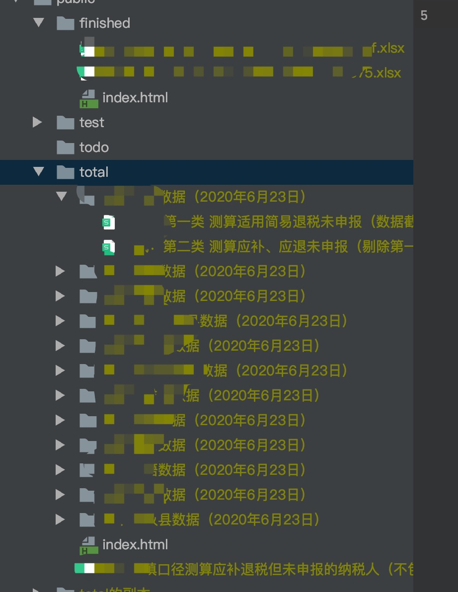

- 我是帮税务朋友做的，金三的数据是怎么来的，我不清楚，他提供了已经完成汇算清缴的文件和尚未完成汇算清缴的文件，大致格式如下 

- 暂时只考虑了xlsx的情况，csv、xls赶时间，没弄  
- 他给我的文件每列参数是什么也不固定，我写了个简单的判断，能智能识别出纳税人、纳税人识别号（自然人）、联系方式、扣缴义务人纳税识别号（单位税号）这四列
- 金税导出的数据也是脱敏的，所以也不是百分之百准确，我自己定了三个级别的准确度  
    - 绿色：姓名、纳税人识别号、单位纳税识别号、电话
    - 黄色：姓名、纳税人识别号、单位纳税识别号  
    - 黄色：姓名、纳税人识别号、电话  
    - 蓝色：姓名、纳税人识别号&&没有单位、没有电话  
- 一旦待检测的数据被匹配上，纳税人的名字就会在Excel被标记上对应的颜色
- 使用方法：
    - 将已经完成汇算清缴的名单，放在/public/finished/ 文件夹内
    - 将待核验的名单，放在/public/total/ 文件夹内
    - 根目录CLI执行 php index.php
- 小提示：
    - 不要忘记composer安装依赖
    - 存放文件时，支持多文件、多sheet、多层级，系统会自动扫描全部文件进行比对
    
    - 完成比对后，打开原来待核验的Excel文件，就会发现有些纳税人的名字已经有颜色了，这部分人就暂时不用打电话通知完成汇算清缴了
    - 使用时，需要有zip扩展
    
##友情提示：金三导出的数据都是脱敏的，不能保证数据一定准确，本人不对数据准确性负责
####如果对使用有疑问，可在issue留下问题或联系方式